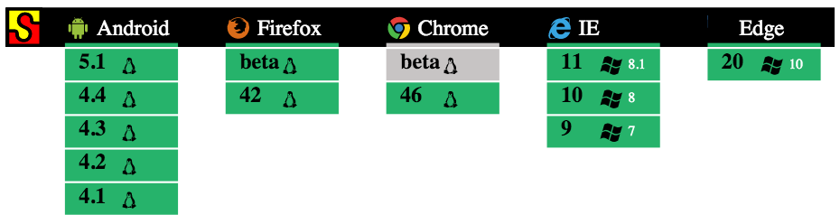

title: Intro to Angular
output: index.html
controls: true
style: assets/styles/styles.css

--


# Intro to AngularJS

--

### What we will cover

This presentation will cover:

* What is AngularJS?
* Why we use Angular for MyAccount.
* Development Paradigms

**Note**: This presentation will only cover AngularJS v1.x  Angular2 is currently in beta.

--

### What is AngularJS?

AngularJS is a frontend javascript framework released in 2009, maintained by Google, developed to address
many of the challenges encountered in developing single-page web applications.

It lends itself to both MVC (Model-View-Controller) and MVVM (Model-View-ViewModel) architectures.

It is built from the ground up, without a large dependency chain. (Does not require jquery)

--

### Key Features

* Strong Separation of Concerns
* Two way data binding
* Extending HTML with Directives (and Components)
* Modular Structure
* Dependency Injection
* Helpful Error Messaging
* Testing Framework

--

### Browser Support



Angular 1.3+ dropped explicit support for IE8.

Angular2.x will have the same browser support.

--

### Separation of Concerns

* Controllers - Controls Scope and business logic
* Services - Data layer
* Directives/Components - Reusable, composable, chunks
* Filters - Data filtering and manipulation
* Templates - Display

--

### Two Way Data Binding

One of the core features of angular is two-way-data-binding. It allows you bind data in a view/template to a controller.

<a href="examples/binding.html" target="_blank">Example</a>

--

### Directives/Components

Directives are markers that allow developers to tie functionality to HTML. 

Can be an attribute, a class, or an element.

Components are a subset of directives that include a template and their own scope.

<a href="examples/directives.html" target="_blank">Directives/Components Example</a>

--

### Services

Services are the data layer of AngularJS. 

<a href="examples/service.html" target="_blank">Service Example</a>

--

### Why We Chose it for MyAccount

Bake-off between:
* BackboneJS
* EmberJS
* AngularJS
* React/Redux

on the Following Criteria:
* Speed of Development
* Community Backing
* Upgrade Path


--

### The Bake-off Results

<table class="table table-bordered data-table">
    <thead>
        <tr>
        <th>Framework</th>
        <th>Pros</th>
        <th>Cons</th>
        </tr>
    </thead>
    <tbody>
        <tr>
            <td>BackboneJS</td>
            <td><ul>
                <li> Team Familiarity </li>
                <li> Customizable  </li>
            </ul></td>
            <td><ul>
                <li>Needed a lot of code</li>
            </ul></td>
        </tr>
        <tr>
            <td>AngularJS</td>
            <td><ul>
                <li>Large Community</li>
                <li>Strong Paradigms</li>
                <li>Complete Solution</li>
                <li>Speed</li>
            </ul></td>
            <td><ul>
                <li>Learning Curve</li>
                <li>New Testing Framework</li>
            </ul></td>
        </tr>
        <tr>
            <td>EmberJS</td>
            <td><ul>
                <li>Minimal coding to get running</li>
                <li>Clear Migration Path</li>
            </ul></td>
            <td><ul>
                <li>Learning Curve</li>
                <li>Lot of Overrides</li>
                <li>A lot of middleware reconfiguration</li>
            </ul></td>
        </tr>
        <tr>
            <td>React/Redux</td>
            <td><ul>
                <li>Fast</li>
                <li>Easily Tested (state tree)</li>
            </ul></td>
            <td><ul>
                <li>Steep Learning Curve</li>
                <li>Less Stable Community</li>
            </ul></td>
        </tr>
    </tbody>
</table>

--

### Post Bake-off Results

A list of metrics since we have moved to angular:
* All Non-Angular Team members had code committed within a day
* Rewrote 2 months of work in 4 days
* Significantly Reduced the size of the code base
* Separated frontend and middleware into separate repos

--

### Structure
We have adopted the following structure for our MyAccount.
```
app/
 - config/
    - routes.js
    - interceptors.js
 - constants/
    - events.js
    - states.js
 - controllers/
    - globalController.js
    ...
 - directives/
    - directive-name/
        - directive.js
        - directive-template.html
    ...
 - filters/
    ...
 - services/
    ...
 - templates/
    ...
 - app.js
```

--
### GlobalController

We adopted a GlobalController Pattern that sits at the very top level of our application.

Since all controllers inside of it will inherit `$scope` from it, it allows us a single layer 
to handle data and application state.

--
### Tools

* Karma - in browser testing
* Jasmine - testing framework
* ng-html2js - preloading templates
* gulp - build tool
* ngDocs - angular specific generated documentation [Our Docs](https://github.comcast.com/pages/Xfinity/MyAccountWeb-FE/#/api/my_account)
